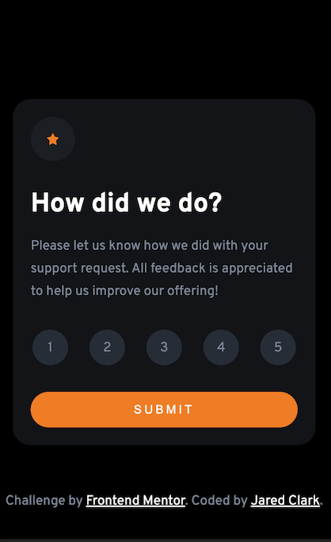

# Frontend Mentor - Interactive rating component solution

This is a solution to the [Interactive rating component challenge on Frontend Mentor](https://www.frontendmentor.io/challenges/interactive-rating-component-koxpeBUmI).

## Table of contents

- [Overview](#overview)
  - [The challenge](#the-challenge)
  - [Screenshot](#screenshot)
  - [Links](#links)
- [My process](#my-process)
  - [Built with](#built-with)
  - [What I learned](#what-i-learned)
  - [Continued development](#continued-development)
- [Author](#author)


## Overview

### The Challenge

Users should be able to:

- View the optimal layout for the app depending on their device's screen size
- See hover states for all interactive elements on the page
- Select and submit a number rating
- See the "Thank you" card state after submitting a rating

### Screenshots

Desktop View:

 

Mobile View: 

 

### Links

- Solution URL: [github repository](https://github.com/helloredfox/interactive_rating_component)
- Live Site URL: [github pages](https://helloredfox.github.io/interactive_rating_component/)

## My process

### Time Estimate
Total time estimate: 3 hours 45 minutes. (225 minutes)

Actual time: 3 hours (180 minutes)

### Built with

- Semantic HTML5 markup
- CSS custom properties
- Flexbox
- JavaScript


### What I learned

As I was thinking about the structure for the HTML, I realized that semantically and for accessibility reasons, the clickable numbers
needed to be radio buttons.

The HTML below has a semantic fieldset tag to group the radio buttons, a semantic legend tag to label it, and CSS that 
makes the corresponding labels look like clickable buttons. I'm proud of the HTML choices I made, and that I decided to write CSS that styled 
good HTML, instead of writing HTML based on how easy I thought it would be to style with CSS.

```html
<form class="my-form">
        <h1>How did we do?</h1>
        <p class="how-did-we-do">Please let us know how we did with your support request. All feedback is appreciated 
          to help us improve our offering!</p>
        <fieldset>
          <legend>Rating Selection</legend>

          <input type="radio" name ="rating" value="1" id="one">
          <label for="one">1</label>
          
          <input type="radio" name ="rating" value="2" id="two">
          <label for="two">2</label>
          
          <input type="radio" name ="rating" value="3" id="three">
          <label for="three">3</label>
          
          <input type="radio" name ="rating" value="4" id="four">
          <label for="four">4</label>
          
          <input type="radio" name ="rating" value="5" id="five">
          <label for="five">5</label>
        </fieldset>
        <button>Submit</button>
      </form>
```
```css
label {
    box-sizing: border-box;
    color: var(--medium-gray);
    background-color: var(--dark-blue);
    display: inline-block;
    height: var(--circle-height);
    width: var(--circle-width);
    border-radius: 50%;
    line-height: 3.5rem;
    cursor: pointer;
    margin: 0;
}
```


### Continued development
I want to continue to focus on great HTML, and it's separation from CSS in future projects. I loved the challenge that this project presented.

I want to start getting in the habit of doing code reviews as well. In a week or so, when I'm a little less familiar with all the code I've written here, I'll come back and review everything. Hopefully it all makes sense then, but if not, I'll refactor!


## Author

- CodePen - [@helloredfox](https://codepen.io/helloredfox/pens/showcase)
- Frontend Mentor - [@helloredfox](https://www.frontendmentor.io/profile/helloredfox)


